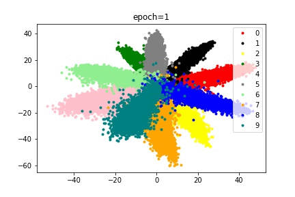
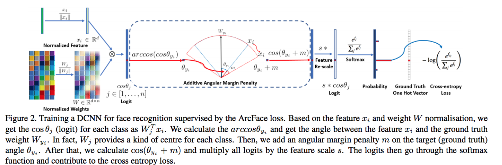
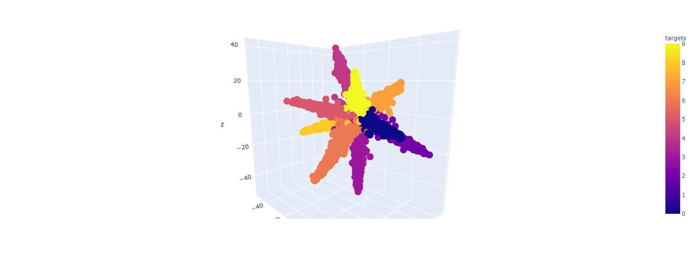

# Realization of arcface loss function on mnist dataset

Arcface loss is a loss function in face recognition. For face recognition, there is also a commonly used loss function centerloss, but centerloss has a relatively large defect, that is, when there are more categories, GPU memory requirements are relatively high, which is more expensive. And the effect of arcface loss is better than centerloss, becauseThe former is based on angle, while the latter is based on distance,For classification, the impact of arcfaceloss is more direct.

  

  
  

